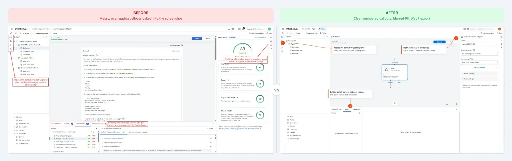

# UiPath Docs Screenshot Standards

A Claude skill for turning raw UiPath Studio screenshots into documentation-ready images. Crops to content, blurs PII, adds numbered callouts, exports as WebP.

---



---

## What this is

Raw screenshots from UiPath Studio are noisy — browser chrome, empty space, overlapping text callouts baked into the image, usernames and tenant names visible. This repo gives you a Claude skill that handles the cleanup.

You point it at a screenshot, tell it what to annotate, and it produces a Node.js script that crops the image, blurs any sensitive data it finds, places numbered callouts in the right positions, and exports at the right size for docs.

The output follows a consistent standard across every screenshot: one annotation color (#FA4616), clean numbered circles, Gaussian blur on PII, WebP at 90% quality.

---

## How to use it

In Claude Code, run:

```
/screenshot-transform
```

| Variable | What it does | Default |
|----------|-------------|---------|
| `INPUT` | Path to the raw screenshot | required |
| `TEMPLATE` | Type of screenshot | `auto` |
| `ANNOTATE` | Callout definitions, e.g. `"1:Save button,2:Name field"` | none |
| `BLUR` | What to blur | `email,username,tenant,token` |
| `OUTPUT_DIR` | Where to save the result | required |

Claude analyzes the image, classifies it if you used `auto`, defines the crop, generates a runnable Node.js script using `sharp`, and gives you the exact git commands to commit the output.

---

## Templates

| Template | Use for |
|----------|---------|
| `modal` | Overlay dialogs with darkened background |
| `config-panel` | Side panels occupying 25-40% of screen width |
| `table` | Tabular data with a header row |
| `step` | Single button or field focus under 400px |
| `overview` | Full-page layout with navigation visible |
| `auto` | Claude classifies based on the screenshot content |

---

## Output standard

| Property | Value |
|----------|-------|
| Annotation color | #FA4616 (UiPath red) |
| Callout style | Filled circle, 24px, white number, Inter Bold 13px |
| Blur | Gaussian sigma 8, rounded rect mask |
| Export format | WebP, 90% quality, 1x resolution |
| Filename pattern | `{product-area}-{action}-{step}.webp` |

---

## Standards reference

Full style guide, template rules, and example transformations are in `.claude/skills/screenshot-transform/SKILL.md`.
